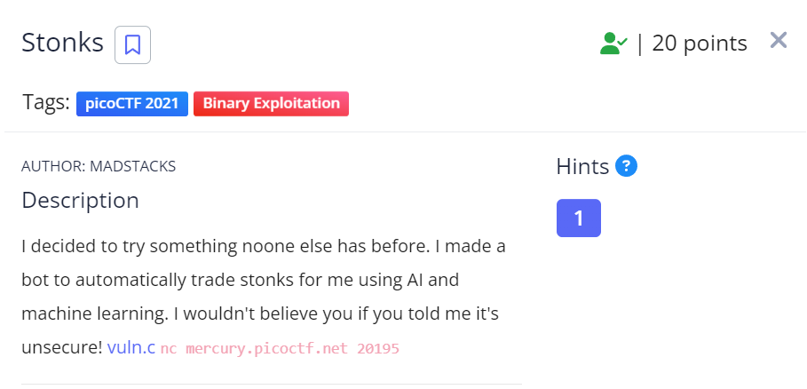
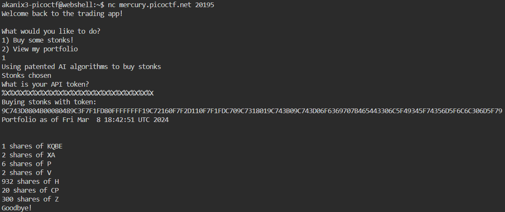
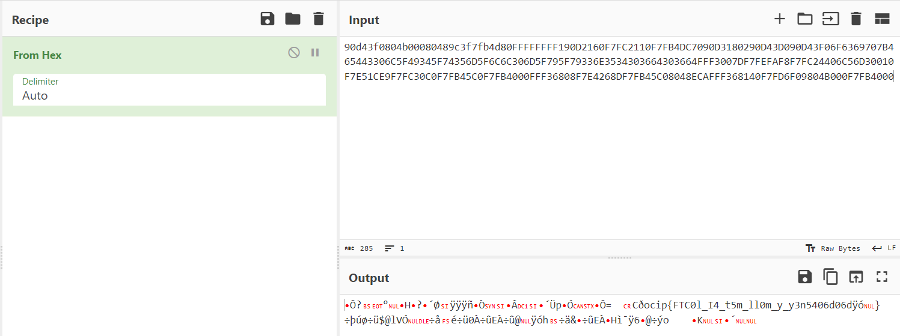
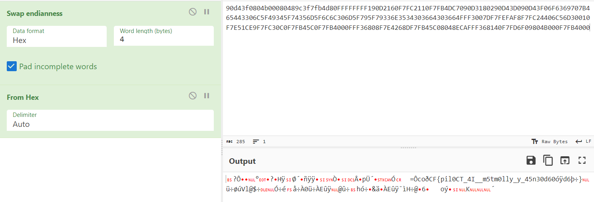
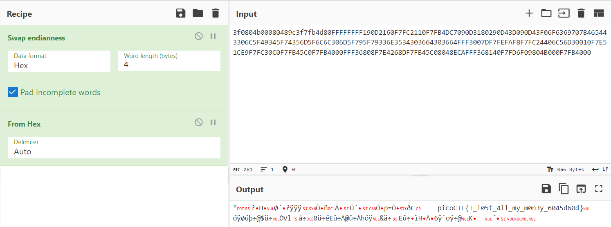

We are given a ```vuln.c``` file and netcat ```nc mercury.picoctf.net 20195``` where this file executes.

```
#include <stdlib.h>
#include <stdio.h>
#include <string.h>
#include <time.h>

#define FLAG_BUFFER 128
#define MAX_SYM_LEN 4

typedef struct Stonks {
	int shares;
	char symbol[MAX_SYM_LEN + 1];
	struct Stonks *next;
} Stonk;

typedef struct Portfolios {
	int money;
	Stonk *head;
} Portfolio;

int view_portfolio(Portfolio *p) {
	if (!p) {
		return 1;
	}
	printf("\nPortfolio as of ");
	fflush(stdout);
	system("date"); // TODO: implement this in C
	fflush(stdout);

	printf("\n\n");
	Stonk *head = p->head;
	if (!head) {
		printf("You don't own any stonks!\n");
	}
	while (head) {
		printf("%d shares of %s\n", head->shares, head->symbol);
		head = head->next;
	}
	return 0;
}

Stonk *pick_symbol_with_AI(int shares) {
	if (shares < 1) {
		return NULL;
	}
	Stonk *stonk = malloc(sizeof(Stonk));
	stonk->shares = shares;

	int AI_symbol_len = (rand() % MAX_SYM_LEN) + 1;
	for (int i = 0; i <= MAX_SYM_LEN; i++) {
		if (i < AI_symbol_len) {
			stonk->symbol[i] = 'A' + (rand() % 26);
		} else {
			stonk->symbol[i] = '\0';
		}
	}

	stonk->next = NULL;

	return stonk;
}

int buy_stonks(Portfolio *p) {
	if (!p) {
		return 1;
	}
	char api_buf[FLAG_BUFFER];
	FILE *f = fopen("api","r");
	if (!f) {
		printf("Flag file not found. Contact an admin.\n");
		exit(1);
	}
	fgets(api_buf, FLAG_BUFFER, f);

	int money = p->money;
	int shares = 0;
	Stonk *temp = NULL;
	printf("Using patented AI algorithms to buy stonks\n");
	while (money > 0) {
		shares = (rand() % money) + 1;
		temp = pick_symbol_with_AI(shares);
		temp->next = p->head;
		p->head = temp;
		money -= shares;
	}
	printf("Stonks chosen\n");

	// TODO: Figure out how to read token from file, for now just ask

	char *user_buf = malloc(300 + 1);
	printf("What is your API token?\n");
	scanf("%300s", user_buf);
	printf("Buying stonks with token:\n");
	printf(user_buf);

	// TODO: Actually use key to interact with API

	view_portfolio(p);

	return 0;
}

Portfolio *initialize_portfolio() {
	Portfolio *p = malloc(sizeof(Portfolio));
	p->money = (rand() % 2018) + 1;
	p->head = NULL;
	return p;
}

void free_portfolio(Portfolio *p) {
	Stonk *current = p->head;
	Stonk *next = NULL;
	while (current) {
		next = current->next;
		free(current);
		current = next;
	}
	free(p);
}

int main(int argc, char *argv[])
{
	setbuf(stdout, NULL);
	srand(time(NULL));
	Portfolio *p = initialize_portfolio();
	if (!p) {
		printf("Memory failure\n");
		exit(1);
	}

	int resp = 0;

	printf("Welcome back to the trading app!\n\n");
	printf("What would you like to do?\n");
	printf("1) Buy some stonks!\n");
	printf("2) View my portfolio\n");
	scanf("%d", &resp);

	if (resp == 1) {
		buy_stonks(p);
	} else if (resp == 2) {
		view_portfolio(p);
	}

	free_portfolio(p);
	printf("Goodbye!\n");

	exit(0);
}
```

Here we can see that the "buy_stonks" function has a print function which can be exploitable, So passing input as ```%x``` we can retrieve data from the stack. This gives us hexadecimal values which we can decode.



we can see that the hexadecimals values have to be rearranged. This is due to retrieving single values from the stack one by one which gives the string in reversed format. 



Swapping the ascii values one by one, as 4 hex denotes 1 ascii we swap the values in a group of 4.



The string is still not in the correct order, this is due to the arrangement of bytes, so removing one byte at a time. This helped to format the string in the correct order.



And the flag is
```
picoCTF{I_l05t_4ll_my_m0n3y_6045d60d}
```