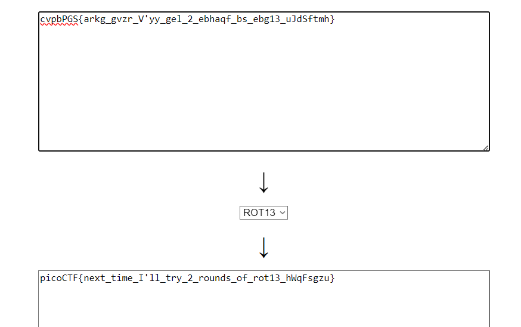

# Mod 26 (picoCTF 2021 | 10 pts)


In this cryptography category type question, it mentions about ROT13. 



Searching up ROT13 decoder online and inputting the given flag through the decoder we get the flag!
```
picoCTF{next_time_I'll_try_2_rounds_of_rot13_hWqFsgzu}
```