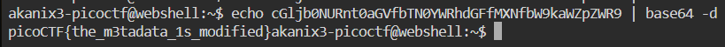

In this question we can use multiple approaches to get information about the file. Some ways can be like using ```strings``` with ```grep``` or using ```binwalk``` or even an ```hexeditor``` .

I chose doing it using the ```exiftool``` command. The ```exiftool``` gives us the ability to read, write and manipulate metadata of file.


The "License" seems like it might be the flag, so decoding this using base64 decoder



We get the flag!
```
picoCTF{the_m3tadata_1s_modified}
```
