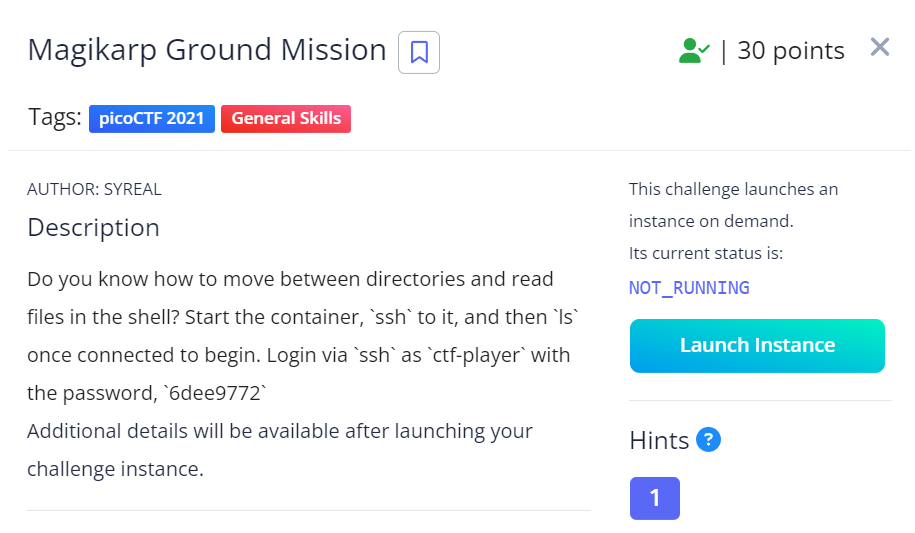
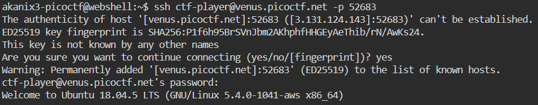
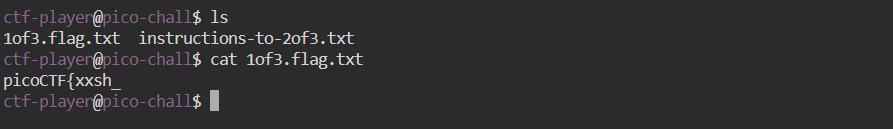
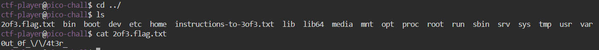
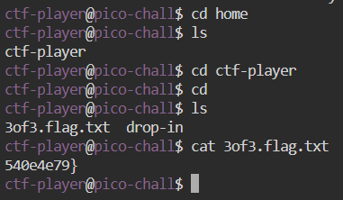

# Magikarp Ground Mission (2021 | 30 pts)



This question requires us to launch an instance & connect via ssh.

```
ssh ctf-player@venus.picoctf.net -p 52683
```

Then entering the given password



Using the ```ls``` command to view files of directory and ```cat``` command to view contents of "1of3.flag.txt"



The instructions mention going to the root directory. Using the ```cd ../``` command to get out of all the directories. Here we find the 2nd part of the flag.



The instructions mention visiting the "home" directory so we use the ```cd``` command. This gives us the last of part of the flag.



Combining each part together, we get the flag!

```
picoCTF{xxsh_0ut_0f_\/\/4t3r_540e4e79}
```
