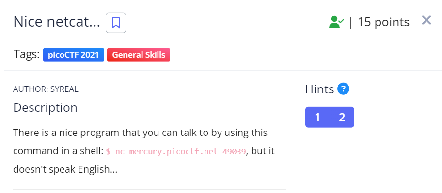

Running the given netcat command we get a few numbers. 

![[Pasted image 20240222234535.png]]

These values seem like ASCII indexes so converting the numbers from ASCII index to value we get the flag!

![[Pasted image 20240222234819.png]]