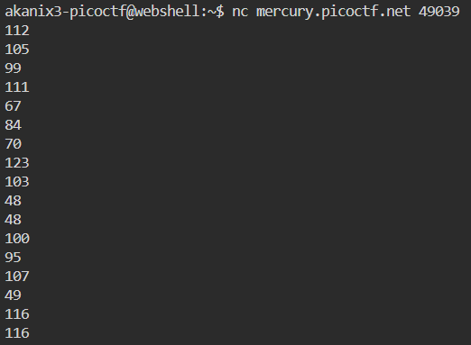
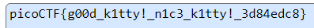

Running the given netcat command we get a few numbers. 



These values seem like ASCII indexes so converting the numbers from ASCII index to value we get the flag!



```
picoCTF{g00d_k1tty!_n1c3_k1tty!_3d84edc8}
```
