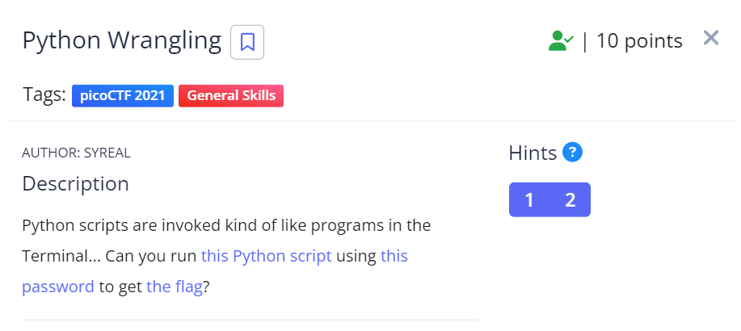
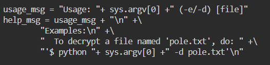
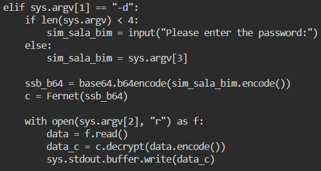
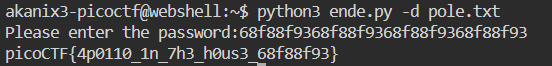

# Python Wrangling (2021 | 10 pts)



We are given a python script [ende](files/ende) 

A txt file [pw](files/pw.txt) containing encoded password
```
68f88f9368f88f9368f88f9368f88f93
```

An EN file [flag.txt](files/flag.txt.en) containing the encoded flag
```
gAAAAABgUAIV8D5MJdzgLLTkkMlbU84ARVwfX4brMt2rJQCjkpLItytfWVZe1L2dp4K8VrKgRU3axStKJEAqcM0iDaxiYE54Boh8UfAAo1RNifKnlDrFz0gLaznVSFVj2xAUa4V35180
```

In the given python script, we can see that the script requires a "pole.txt" file to decrypt. So we'll rename the flag file to "pole.txt" using the ```cp``` command.

 

The script also supports two arguments for encoding (-e) and decoding (-d). Reviewing the part for decoding we can see it requires less than 4 arguments when it's run. 



In short running the script as
```
python3 ende.py -d pole.txt
```



We get the flag!

```
picoCTF{4p0110_1n_7h3_h0us3_68f88f93}
```
