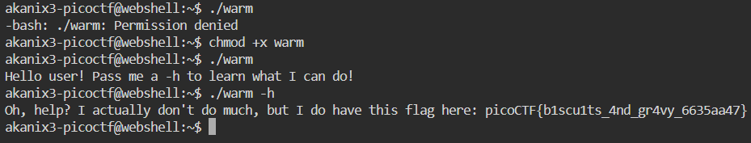

This question requires us to change file permissions, to do this we have the ```chmod``` command and setting permission to executable by ```+x``` we can execute the file. 



We got the flag!

```
picoCTF{b1scu1ts_4nd_gr4vy_6635aa47}
```