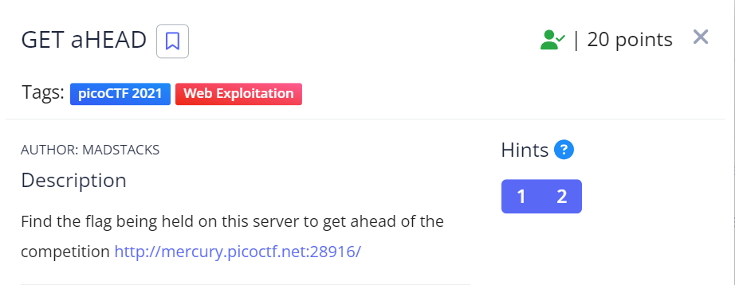
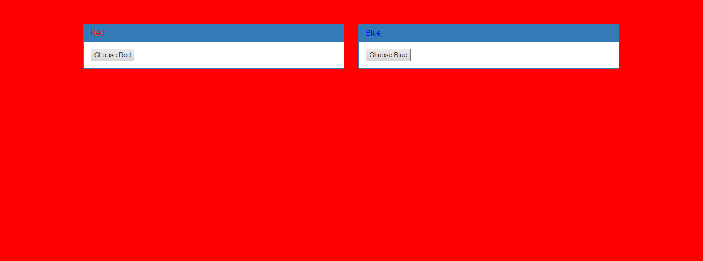
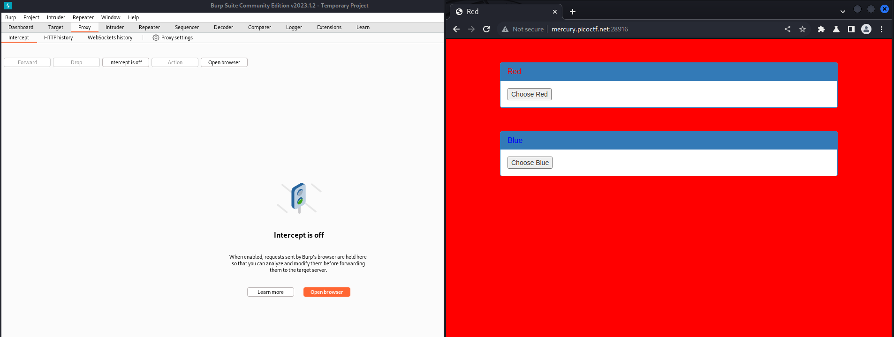
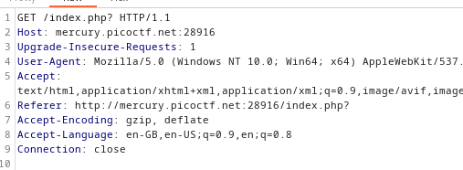
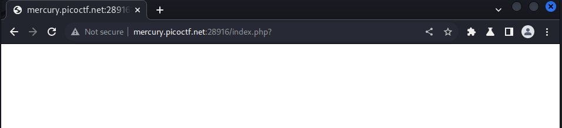
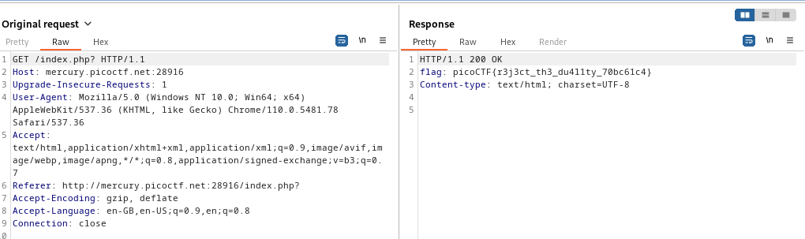

The link takes us to this website where we can change colors of the webpage accordingly. This tells us that the webpage takes HTTPS request.



We can analyse the request by capturing the "GET" and "POST" request using BurpSuite.



Using the proxy intercept we can get each packet being send and received to and from the server.



Changes the "GET" to "HEAD" which would return a similar response. Even though the website loads a blank page.



Checking the https history of the packets. We can see that our modified GET request gave us the flag in the response.



and here we got the flag!
```
picoCTF{r3j3ct_th3_du4llty_70bc61c4}
```